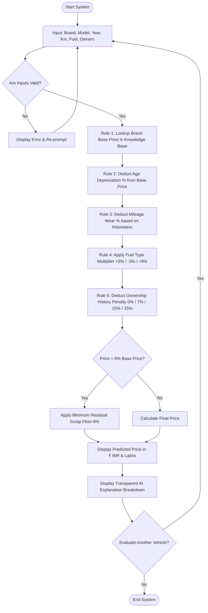

# 🚗 AI Car Price Predictor (Rule-Based Expert System)


-success)


A comprehensive Python and Web laboratory project that estimates the fair resale market price of used cars using a **Deterministic Rule-Based AI Expert System / Heuristic Algorithm**. 

---

## 📑 Table of Contents
1. [Project Overview & Abstract](#-project-overview--abstract)
2. [AI Concept: Rule-Based AI vs Machine Learning](#-ai-concept-rule-based-ai-vs-machine-learning)
3. [Architecture of the Expert System](#-architecture-of-the-expert-system)
4. [Heuristic Algorithm & Mathematical Rules Matrix](#-heuristic-algorithm--mathematical-rules-matrix)
5. [Visual Flowcharts](#-visual-flowcharts)
6. [How to Run the Web Application on Localhost](#-how-to-run-the-web-application-on-localhost)
7. [How to Run the Python CLI Program](#-how-to-run-the-python-cli-program)
8. [Sample Test Cases & Execution Logs](#-sample-test-cases--execution-logs)
9. [College Viva Voce Q&A Preparation](#-college-viva-voce-qa-preparation)
10. [Repository File Structure](#-repository-file-structure)

---

## 📌 Project Overview & Abstract

In real-world automotive valuation, used car prices depend on deterministic market rules, structured depreciation curves, odometer wear brackets, fuel market dynamics, and ownership transfer history. 

While statistical Machine Learning models treat price prediction as a "black box" that requires vast datasets, this project demonstrates **Symbolic / Rule-Based Artificial Intelligence (Expert Systems)**. It encodes domain expertise directly into a structured **Knowledge Base** and evaluates user parameters using an **Inference Engine** with full transparency and step-by-step reasoning.

### Key Highlights:
- **Dual Interface**: Runs both as an interactive **Web Application** (with dark-mode glassmorphism and real-time sliders) and as a **Python CLI Script**.
- **100% Explainable**: Displays an exact rupee-by-rupee deduction breakdown for every heuristic rule applied.
- **Zero External Dependencies**: Works out-of-the-box with Python standard libraries and vanilla web technologies.
- **Resilience & Safety**: Enforces input validation and a minimum residual asset floor (8% scrap value) to prevent negative or zero valuations.

---
## 🚀 Live Demo

> Try the deployed application here:

👉 **[AI Car Price Predictor – Live Demo](https://ai-car-price-predictor-4.onrender.com)**

The application uses a rule-based AI expert system to estimate a vehicle's resale value based on:
- 🚗 Car brand and model
- 📅 Manufacturing year
- 🛣️ Kilometers driven
- ⛽ Fuel type
- 👤 Ownership history
- 💰 Original car price

[View Live Project](https://ai-car-price-predictor-4.onrender.com)


## 🧠 AI Concept: Rule-Based AI vs Machine Learning

### What is Rule-Based AI?
> *"This project implements a **Rule-Based AI Expert System**. Instead of training an opaque statistical model on historical datasets, it uses predefined domain knowledge and sequential IF-THEN heuristic rules to evaluate car characteristics (such as vehicle age, odometer mileage, fuel efficiency, and ownership history) and calculate the resale valuation."*

### Detailed Comparison Table:

| Feature | Rule-Based AI (Expert System) 🏆 *(Used Here)* | Machine Learning (ML) Models |
| :--- | :--- | :--- |
| **Decision Mechanism** | Deterministic domain rules & heuristics | Statistical pattern matching & weights |
| **Explainability** | **100% Transparent** (Every step is traceable) | Opaque / "Black-Box" (Hard to debug) |
| **Training Data** | **Zero Data Required** (Uses knowledge base) | Requires large CSV / database files |
| **Hardware Overhead** | Minimal (Runs instantly on any CPU) | High (Requires GPU / heavy RAM for training) |
| **Overfitting Risk** | None (Rules are consistent and bounded) | High risk of overfitting on small datasets |
| **Suitability for Lab** | **Ideal for college mini-projects & viva** | Complex to explain internal math in viva |

---

## 🏗️ Architecture of the Expert System

The system follows the classical three-tier Expert System architecture:

```
                  +-----------------------------------+
                  |            USER INPUTS            |
                  |  Brand, Model, Year, Km, Fuel,    |
                  |  Previous Owners, Custom Price    |
                  +-----------------+-----------------+
                                    |
                                    v
+-----------------------+   +-------------------+   +-------------------------+
|    KNOWLEDGE BASE     |-->| INFERENCE ENGINE  |-->|  EXPLANATION FACILITY   |
| - Brand Price Tiers   |   | - Forward-chain   |   | - Rupee-level breakdown |
| - Depreciation curves |   |   IF-THEN rules   |   | - Retention percentage  |
| - Residual floors     |   | - Safety clamp    |   | - AI market insights    |
+-----------------------+   +-------------------+   +-------------------------+
                                    |
                                    v
                  +-----------------------------------+
                  |          PREDICTED PRICE          |
                  |    ₹ INR & Lakhs Valuation        |
                  +-----------------------------------+
```

1. **Knowledge Base**: Contains domain benchmark prices for economy, mid-range, premium, and luxury brand tiers.
2. **Inference Engine**: Executes forward-chaining rules in sequential stages:
   $$\text{Base Price} \longrightarrow \text{Age Drop} \longrightarrow \text{Mileage Wear} \longrightarrow \text{Fuel Adj.} \longrightarrow \text{Owner Penalty} \longrightarrow \text{Safety Floor}$$
3. **Explanation Facility**: Translates numeric deductions into human-readable explanations displayed on the CLI and Web dashboard.

---

## ⚙️ Heuristic Algorithm & Mathematical Rules Matrix

### Step 1: Base Price Benchmark Lookup ($B$)
The algorithm searches the Knowledge Base for the brand benchmark:
- **Economy Brands** (Maruti, Renault, Nissan): ₹6,00,000 – ₹6,50,000
- **Mid-Range Brands** (Hyundai, Tata, Ford): ₹7,50,000 – ₹8,00,000
- **Upper Mid-Range** (Honda, Mahindra, Kia, VW, Skoda): ₹9,50,000 – ₹11,00,000
- **Premium / SUV** (Toyota, MG): ₹12,00,000
- **Luxury Segment** (BMW, Audi, Mercedes-Benz, Jaguar, Volvo): ₹32,00,000 – ₹40,00,000
- **User Override**: If the user provides the exact original ex-showroom price, that value takes precedence.

---

### Step 2: Vehicle Age Depreciation ($D_{\text{age}}$)
Calculated based on manufacturing age ($\text{Age} = \text{Current Year} - \text{Manufacturing Year}$):

$$\text{Depreciation \%} = \begin{cases} 
5\% & \text{if Age} = 0 \text{ (Same-year showroom exit)} \\
15\% & \text{if Age} = 1 \\
15\% + (\text{Age} - 1) \times 8\% & \text{if } 2 \le \text{Age} \le 5 \\
15\% + 32\% + (\text{Age} - 5) \times 5\% & \text{if } 6 \le \text{Age} \le 10 \\
15\% + 32\% + 25\% + (\text{Age} - 10) \times 3\% & \text{if Age} > 10 
\end{cases}$$

*Note: Maximum age depreciation is capped at $80\%$ to prevent total devaluation.*

$$P_1 = \max(B \times 0.15, B - D_{\text{age}})$$

---

### Step 3: Odometer Mileage Wear Depreciation ($D_{\text{mileage}}$)
Evaluates mechanical wear and tear based on total kilometers driven:

| Odometer Range (km) | Wear Category | Depreciation Rate | Heuristic Justification |
| :--- | :--- | :--- | :--- |
| **0 – 20,000 km** | Minimal Wear | **2%** | Almost new engine and tires |
| **20,001 – 50,000 km** | Moderate Wear | **6%** | Standard urban commuting |
| **50,001 – 100,000 km** | Average Wear | **12%** | Normal suspension and brake cycle |
| **100,001 – 150,000 km** | High Wear | **20%** | Approaching major maintenance service |
| **> 150,000 km** | Heavy Wear | **28%** | Severe wear on powertrain & gearbox |

$$P_2 = \max(B \times 0.10, P_1 - D_{\text{mileage}})$$

---

### Step 4: Fuel Type Market Adjustment ($F_{\text{fuel}}$)
Applies a market value multiplier based on fuel efficiency and powertrain demand:

| Fuel Type | Adjustment Factor | Market Reasoning |
| :--- | :--- | :--- |
| **Diesel** | **+5% Value** | High highway fuel efficiency, torque, and engine durability |
| **Petrol** | **0% (Baseline)** | Standard market baseline for passenger cars |
| **CNG** | **-3% Discount** | Lower running cost offset by trunk space loss & engine dry-run |
| **Electric (EV)** | **+8% Premium** | Modern green tech, zero tailpipe emissions, low running cost |
| **Hybrid** | **+6% Premium** | Dual-powertrain fuel economy and low emissions |

$$P_3 = P_2 + F_{\text{fuel}}$$

---

### Step 5: Ownership History Penalty ($P_{\text{owner}}$)
Reflects buyer trust and maintenance record continuity:

| Ownership Bracket | Penalty Rate | Impact |
| :--- | :--- | :--- |
| **1st Owner (Single Hand)** | **0% Penalty** | High buyer trust and consistent service history |
| **2nd Owner** | **-7% Discount** | Standard secondary ownership transfer drop |
| **3rd Owner** | **-15% Discount** | Moderate wear ambiguity and service gaps |
| **4+ Owners** | **-25% Discount** | Significant multi-hand resale depreciation |

$$P_4 = P_3 - P_{\text{owner}}$$

---

### Step 6: Minimum Residual Asset Value Floor
To ensure the vehicle always retains scrap and spare parts value:

$$P_{\text{final}} = \max(P_4, B \times 0.08)$$

---

## 📊 Visual Flowcharts

### 1. Mermaid Flowchart


### 2. ASCII Architecture Diagram
```
                     +---------------------------------------+
                     |                 START                 |
                     +-------------------+-------------------+
                                         |
                                         v
                     +---------------------------------------+
                     |         PROMPT VEHICLE INPUTS         |
                     | (Brand, Model, Year, Km, Fuel, Owner) |
                     +-------------------+-------------------+
                                         |
                                         v
                     +---------------------------------------+
                     |         VALIDATE USER INPUTS          |
                     +-------------------+-------------------+
                                    /         \
                             [Invalid]       [Valid]
                                /                 \
                     [Display Error]      [Step 1: Fetch Base Price]
                                                      |
                                                      v
                                         [Step 2: Age Depreciation]
                                                      |
                                                      v
                                         [Step 3: Mileage Wear]
                                                      |
                                                      v
                                         [Step 4: Fuel Multiplier]
                                                      |
                                                      v
                                         [Step 5: Owner History]
                                                      |
                                                      v
                                         [Enforce 8% Safety Floor]
                                                      |
                                                      v
                                         [Display Price & AI Steps]
                                                      |
                                                      v
                                         [Predict Another? (y/n)]
                                            /                  \
                                         (Yes)                (No)
                                          /                      \
                                  [Loop to Start]              [ END ]
```

---

## 🌐 How to Run the Web Application on Localhost

The repository includes a web interface with real-time reactive sliders, quick presets, and an AI Rulebook modal.

### Method 1: Using Python Built-in HTTP Server (Recommended)

1. Open your terminal / Command Prompt / PowerShell in the project directory:
   ```bash
   cd c:\Users\AAYUSH\OneDrive\Desktop\yugd
   ```

2. Start the lightweight local server:
   ```bash
   python -m http.server 8000
   ```

3. Open your web browser and navigate to:
   ```
   http://localhost:8000
   ```
   *(or `http://127.0.0.1:8000`)*

> [!TIP]
> If port `8000` is already in use by another application on your PC, you can start it on port `3000` or `5500`:
> ```bash
> python -m http.server 3000
> ```
> Then open `http://localhost:3000` in your browser.

---

### Method 2: Direct File Open (Zero Server Required)
Because the web app uses pure HTML5, CSS3, and Vanilla JavaScript with no external backend build step:
- Navigate to the project folder `yugd/` in Windows File Explorer.
- Double-click **`index.html`** to open it directly in Chrome, Edge, Brave, or Firefox.

---

### Method 3: Using VS Code Live Server Extension
- Open the project folder in **Visual Studio Code**.
- Right-click `index.html` and click **"Open with Live Server"**.
- The page will automatically launch at `http://127.0.0.1:5500/index.html`.

---

## 💻 How to Run the Python CLI Program

For college lab practical sessions where terminal execution is required:

### 1. Run the Python Script:
```bash
python car_price_predictor.py
```

### 2. Follow the Interactive Prompts:
```text
======================================================================
        AI-POWERED USED CAR PRICE PREDICTOR
         (Heuristic Rule-Based Expert System)
======================================================================
Please enter the car details below:
----------------------------------------
1. Enter Car Brand (e.g. Maruti Suzuki, Hyundai, Honda, Toyota): Hyundai
2. Enter Car Model (e.g. Swift, City, Creta, Innova): Creta
3. Enter Manufacturing Year (1990 to 2026): 2021
4. Enter Total Kilometers Driven (0 to 500,000 km): 35000
  Fuel Type Options:
    [1] Petrol
    [2] Diesel
    [3] CNG
    [4] Electric
    [5] Hybrid
  Select Fuel Type (1-5 or name): 2
5. Enter Number of Previous Owners (1 to 10): 1
Do you know the original ex-showroom new price? (y/N): n
```

---

## 🧪 Sample Test Cases & Execution Logs

### Case Study 1: Maruti Suzuki Swift (Petrol, 2nd Owner)
```text
----------------------------------------------------------------------
                    VEHICLE DETAILS SUMMARY
----------------------------------------------------------------------
  * Brand             : Maruti Suzuki
  * Model             : Swift
  * Year              : 2018
  * Age               : 8
  * Kilometers        : 45,000 km
  * Fuel              : Petrol
  * Previous Owners   : 2

======================================================================
   PREDICTED SELLING PRICE: Rs. 193,440.00 INR
   (Approx. Rs. 1.93 Lakhs)
======================================================================

AI INFERENCE BREAKDOWN & EXPLANATION:
----------------------------------------------------------------------
  1. Base Price Benchmark
    -> Matched knowledge base benchmark for 'Maruti Suzuki': Rs. 650,000.00

  2. Vehicle Age Depreciation
    -> Vehicle age is 8 year(s). Applied 62.0% age depreciation (-Rs. 403,000.00).

  3. Mileage / Odometer Wear
    -> Moderate mileage (20k - 50k km): Applied 6.0% mileage depreciation (-Rs. 39,000.00).

  4. Fuel Type Adjustment
    -> Petrol engine: Standard baseline benchmark (0% adjustment).

  5. Ownership History Factor
    -> Second Owner (2nd Hand): Moderate ownership transfer discount (-7%).

  Status Note: All AI heuristic constraints and market factors evaluated successfully.
----------------------------------------------------------------------
```

---

### Case Study 2: Toyota Innova Crysta (Diesel, 1st Owner)
```text
======================================================================
   PREDICTED SELLING PRICE: Rs. 529,200.00 INR
   (Approx. Rs. 5.29 Lakhs)
======================================================================
```

---

## 🎓 College Viva Voce Q&A Preparation

#### Q1: What makes this an "Artificial Intelligence" project if it does not use Machine Learning?
> **Answer:** Artificial Intelligence is broadly divided into two major branches:
> 1. **Symbolic AI (Rule-Based Expert Systems)**: Uses explicit human knowledge, rules of inference, and heuristics.
> 2. **Sub-symbolic AI (Machine Learning & Neural Networks)**: Uses statistical approximations learned from datasets.
>
> This project represents Symbolic AI / Expert Systems, which is one of the classic foundational pillars of Artificial Intelligence.

#### Q2: What is the difference between the Knowledge Base and the Inference Engine in your project?
> **Answer:** 
> - The **Knowledge Base** stores facts and domain benchmarks (e.g. brand price tiers, standard depreciation percentages).
> - The **Inference Engine** is the algorithm that executes forward-chaining `IF-THEN` logical rules on the user's inputs against the knowledge base to derive the price.

#### Q3: Why is a Rule-Based Expert System suitable for used car pricing?
> **Answer:** 
> - **Explainability**: Every deduction (e.g. 62% age drop, ₹39,000 km deduction) is 100% transparent.
> - **Zero Dependency**: Does not require training datasets, GPU resources, or heavy libraries.
> - **Deterministic**: It guarantees consistent valuations without overfitting or dataset bias.

#### Q4: How does your algorithm prevent the price from dropping to negative or zero for very old cars?
> **Answer:** The algorithm incorporates two safety clamps:
> 1. Maximum age depreciation is capped at **80%**.
> 2. A safety **Residual Asset Value Floor (8% of base price)** is enforced, representing the structural scrap and spare parts value of the vehicle.

#### Q5: How are invalid inputs handled in your implementation?
> **Answer:** The program uses dedicated validation routines (`get_valid_int`, `get_valid_float`, `get_valid_fuel_type`) with `try-except` blocks and range boundaries (e.g. Year between 1990 and Current Year, Km between 0 and 500,000) to prevent crashes.

---

## 📁 Repository File Structure

```
yugd/
│
├── index.html               # Web Application UI (HTML5 Semantic Layout & Controls)
├── style.css                # Web Application Styling (Dark Glassmorphic Design System)
├── app.js                   # Web AI Engine (JavaScript Implementation of Rules)
│
├── car_price_predictor.py   # Python CLI Lab Program (Knowledge Base + Inference Engine)
└── README.md                # Comprehensive Lab Documentation & Viva Guide
```

---

## 👨‍💻 Project Authors & Lab Submission

- **Project Title**: Car Price Predictor using Rule-Based AI
- **Domain**: Artificial Intelligence / Expert Systems Mini-Project
- **Language & Frameworks**: Python 3.x, HTML5, CSS3, ES6 JavaScript
- **Standard**: Suitable for B.Tech / BCA / MCA / B.Sc Computer Science AI/Python Laboratory Mini-Projects.
